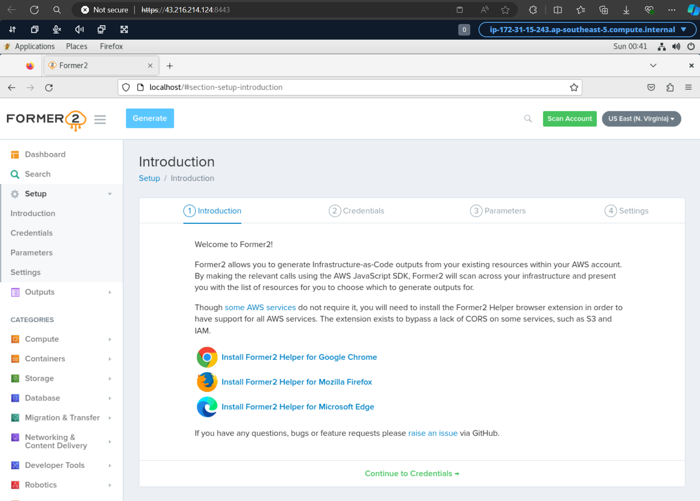

## ec2-former2

[Former2](https://former2.com/) is a website that allows you to generate IaC ([Infrastructure as Code](https://docs.aws.amazon.com/whitepapers/latest/introduction-devops-aws/infrastructure-as-code.html)) templates (such as [CloudFormation](https://docs.aws.amazon.com/whitepapers/latest/introduction-devops-aws/aws-cloudformation.html), [CDK](https://docs.aws.amazon.com/whitepapers/latest/introduction-devops-aws/aws-cdk.html), Terraform, etc) from _existing_ AWS resources and is mentioned on AWS Open Source Blog ([Accelerate infrastructure as code development with open source Former2](https://aws.amazon.com/blogs/opensource/accelerate-infrastructure-as-code-development-with-open-source-former2/) and [How DNAnexus used the open source Former2 project to create infrastructure as code templates for their disaster recovery pipeline](https://aws.amazon.com/blogs/opensource/how-dnanexus-used-the-open-source-former2-project-to-create-infrastructure-as-code-templates-for-their-disaster-recovery-pipeline/)).

Some users have challenges creating [access keys](https://docs.aws.amazon.com/IAM/latest/UserGuide/id_credentials_access-keys.html) while others have security concerns about entering AWS security credentials on an external website, and would prefer a private web instance.  However, Former2 requires [browser helper extension](https://github.com/iann0036/former2-helper) that only works with websites that has domain names 127.0.0.1, localhost, former2.com and www.former2.com.

This CloudFormation template provisions an EC2 instance hosting Former2 website in your AWS account. You can remote in to generate and download IaC templates with temporary security credentials.

## About CloudFormation templates
EC2 instances must be provisioned in a subnet with IPv4 internet connectivity.

## Getting started

###  Provision EC2 with CloudFormation
Download the [CloudFormation template](AmazonLinux2-former2.yaml). Login to your [CloudFormation console](https://console.aws.amazon.com/cloudformation/home#/stacks/create/template). Choose **Create Stack**, **Upload a template file**, **Choose File**, select your .yaml file and choose **Next**. Enter a **Stack name** and specify parameters values.

EC2
- `ec2Name`: EC2 instance name 
- `processorArchitecture`: Intel/AMD x86_64 or Graviton arm64. Default is `Graviton (arm64)`
- `instanceType`: EC2 [instance types](https://aws.amazon.com/ec2/instance-types/). Do ensure type matches processor architecture. 

Network
- `vpcID`: [VPC](https://docs.aws.amazon.com/vpc/latest/userguide/what-is-amazon-vpc.html) with internet connectivity. Select [default VPC](https://docs.aws.amazon.com/vpc/latest/userguide/default-vpc.html) if unsure
- `subnetID`: subnet with internet connectivity. Select subnet in default VPC if unsure
- `displayPublicIP`: set this to `No` if your EC2 instance will not receive [public IP address](https://docs.aws.amazon.com/AWSEC2/latest/UserGuide/using-instance-addressing.html#concepts-public-addresses). EC2 private IP will be displayed in CloudFormation Outputs section instead. Default is `Yes`
- `assignStaticIP`: associates a static public IPv4 address using [Elastic IP address](https://docs.aws.amazon.com/AWSEC2/latest/UserGuide/elastic-ip-addresses-eip.html). Default is `Yes`

Remote Access
- `ingressIPv4`: allowed IPv4 source prefix to your EC2 instance, e.g. `1.2.3.4/32`. You can get your source IP from [https://checkip.amazonaws.com](https://checkip.amazonaws.com)
- `ingressIPv6`: allowed IPv6 source prefix to your EC2 instance. Use `::1/128` to block all incoming IPv6 access. Default is `::/0`

EBS
- `volumeSize`: [Amazon EBS](https://docs.aws.amazon.com/AWSEC2/latest/UserGuide/AmazonEBS.html) volume size
- `volumeType`: [EBS General Purpose Volume](https://aws.amazon.com/ebs/general-purpose/) type

Continue **Next** with [Configure stack options](https://docs.aws.amazon.com/AWSCloudFormation/latest/UserGuide/cfn-console-add-tags.html), [Review Stack](https://docs.aws.amazon.com/AWSCloudFormation/latest/UserGuide/cfn-using-console-create-stack-review.html), and click **Submit** to launch your stack. After your stack has been successfully created, its status changes to **CREATE_COMPLETE**.

### Login to EC2 instance
Once provisioned, go to **Outputs** section and use the **Values** associated with the following **Keys**

- `SSMSessionManager`: provides [shell access](https://aws.amazon.com/blogs/aws/new-session-manager/). From session manager terminal, set your ec2-user password with the command `sudo passwd ec2-user`
- `DCVwebConsole`: [DCV](https://aws.amazon.com/hpc/dcv/) web browser client. Login as **ec2-user** and your configured password. Launch Firefox browser and install **Former 2 Helper for Mozilla Firefox**

- `GetTokenCommand`: Copy entire string. In your DCV session, open a terminal, and paste copied value in to retrieve temporary security credentials*. Use these values to enter IAM credentials at http://localhost/#section-setup-credentials

### Using Former2
Refer to [Accelerate infrastructure as code development with open source Former2](https://aws.amazon.com/blogs/opensource/accelerate-infrastructure-as-code-development-with-open-source-former2/) blog post for usage guidance.

## Attribution
CloudFormation template downloads Former2 web codes from [Ian Mckay](https://github.com/iann0036)'s [GitHub repo](https://github.com/iann0036/former2) which are released under [MIT license](https://github.com/iann0036/former2/blob/master/LICENSE).

## Updating web codes
Former2 is under active development. To download latest codes, login to EC2 instance and run `/home/ec2-user/update-former2` script. 

## About DCV web console
[DCV](https://aws.amazon.com/hpc/dcv/) supports [file transfer](https://docs.aws.amazon.com/dcv/latest/userguide/using-transfer-web.html). Usage indicates acceptance of [DCV EULA](https://www.nice-dcv.com/eula.html).

Native clients can be downloaded from https://download.nice-dcv.com/

## Clean Up
To remove created resources, [delete](https://docs.aws.amazon.com/AWSCloudFormation/latest/UserGuide/cfn-console-delete-stack.html) your created CloudFormation stack

## Security

See [CONTRIBUTING](CONTRIBUTING.md#security-issue-notifications) for more information.

## License

This library is licensed under the MIT-0 License. See the LICENSE file.
